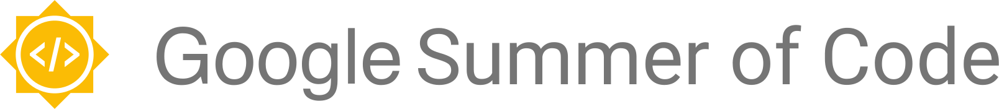

  

# Echopype

  

  

  

  

  

  

  

  

Echopype is a package built to enable interoperability and scalability in ocean sonar data processing. These data are widely used for obtaining information about the distribution and abundance of marine animals, such as fish and krill. Our ability to collect large volumes of sonar data from a variety of ocean platforms has grown significantly in the last decade. However, most of the new data remain under-utilized. echopype aims to address the root cause of this problem - the lack of interoperable data format and scalable analysis workflows that adapt well with increasing data volume - by providing open-source tools as entry points for scientists to make discovery using these new data.

Watch the [echopype talk](https://www.youtube.com/watch?v=qboH7MyHrpU)
at SciPy 2019 for background, discussions and a quick demo!

## Documentation

Learn more about echopype in the official documentation at https://echopype.readthedocs.io. Check out executable examples in the companion repository https://github.com/OSOceanAcoustics/echopype-examples.

## Contributing

You can find information about how to contribute to echopype at our [Contributing Page](https://echopype.readthedocs.io/en/latest/contributing.html).

<!-- ## 

In collaboration with the [Integrated Ocean Observing System (IOOS)](https://ioos.noaa.gov/), the Echopype team aims to recruit talented [Google Summer of Code (GSoC)](https://summerofcode.withgoogle.com/)
participants to help us upgrade the robustness and scalability of the Echopype package.

If you are a GSoC 2024 contributor, please head over to [GSoC contributor's guide](gsoc_contrib_guide.md) to get more information specific to the program. -->

## Echopype doesn't run on your data?

Please report any bugs by [creating issues on GitHub](https://medium.com/nyc-planning-digital/writing-a-proper-github-issue-97427d62a20f).

[Pull requests](https://jarednielsen.com/learn-git-fork-pull-request/) are always welcome!

## Contributors

Wu-Jung Lee ([@leewujung](https://github.com/leewujung))
founded the echopype project in 2018 and continue to be the primary contributor
together with Caesar Tuguinay([@ctuguinay](https://github.com/ctuguinay)).
Emilio Mayorga ([@emiliom](https://github.com/emiliom)),
Landung "Don" Setiawan ([@lsetiawan](https://github.com/lsetiawan)),
Praneeth Ratna([@praneethratna](https://github.com/praneethratna)),
Brandon Reyes ([@b-reyes](https://github.com/b-reyes)),
Kavin Nguyen ([@ngkavin](https://github.com/ngkavin))
and Imran Majeed ([@imranmaj](https://github.com/imranmaj))
have contributed significantly to the code.
Valentina Staneva ([@valentina-s](https://github.com/valentina-s)) is also part of the development team.

A complete list of direct contributors is on our [GitHub Contributors Page](https://github.com/OSOceanAcoustics/echopype/graphs/contributors).

## Acknowledgement

We thank all previous and current contributors to Echopype,
including those whose contributions do not include code.
We thank Dave Billenness of ASL Environmental Sciences for
providing the AZFP Matlab Toolbox as reference for developing
support for the AZFP echosounder,
Rick Towler ([@rhtowler](https://github.com/rhtowler))
of the NOAA Alaska Fisheries Science Center
for providing low-level file parsing routines for
Simrad EK60 and EK80 echosounders,
and Alejandro Ariza ([@alejandro-ariza](https://github.com/alejandro-ariza))
for developing NumPy implementation of
acoustic analysis functions via Echopy, which
we referenced for several Echopype functions.

We also thank funding support from
the National Science Foundation,
NOAA Ocean Exploration,
NOAA Fisheries,
and software engineering support from
the University of Washington Scientific Software Engineering Center (SSEC),
as part of the Schmidt Futures Virtual Institute for Scientific Software (VISS) in 2023.

  

  

  

## License

Echopype is licensed under the open source [Apache 2.0 license](https://opensource.org/licenses/Apache-2.0).

---------------

Copyright (c) 2018-2024, Echopype Developers.
