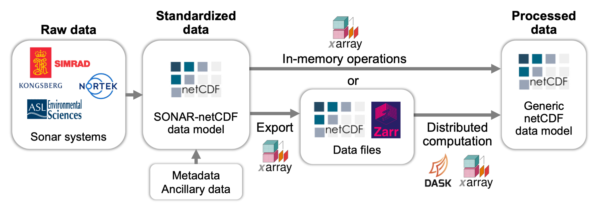

# Development roadmap

## Overview
We aim for Echopype to provide "building blocks" that can be strung together to construct processing pipelines for water column sonar data to bring raw instrument-generated files to "analysis-ready" data products that can be easily leveraged by further downstream processing routines.
To this end, the Echopype workflow focuses first on standardizing data to the widely supported netCDF data model, and based on the standardized data build computational routines by leveraging open-source scientific Python libraries, especially those in the [Pandata](https://github.com/panstacks/pandata?tab=readme-ov-file) stack. See the [Echopype paper](https://doi.org/10.1093/icesjms/fsae133) for more details on the design philosophy.

## Development priorities

### Dependency resolution
Echopype depends on many libraries in the scientific Python ecosystem, and therefore need to keep up with their updates. The two big ticket items that we hope to resolve soon are:
- upgrade to use Numpy version 2
- upgrade to use Zarr version 3

See the [`requirements.txt`](https://github.com/OSOceanAcoustics/echopype/blob/main/requirements.txt) file for the current pinned versions. Ideally we would like to unpin the maximum version when possible.

### Data conversion and standardization

### Rule-based algorithms
We plan to add more rule-based algorithms that are commonly used to analyze echosounder data into Echopype. The high priority categories and the corresponding proposed subpackages are:
- full support for broadband processing (in the `calibrate` subpackage)
  - currently `calibrate.compute_Sv` supports generating band-averaged Sv for broadband data
- noise removal (in the `clean` subpackage)
  - currently [`clean`](https://echopype.readthedocs.io/en/stable/api.html#module-echopype.clean) contains a handful of noise removal functions from {cite:p}`Ryan2015`.
  - there are many others that can be useful, including [a more efficient algorithm for detecting transient noise](https://github.com/open-ocean-sounding/echopy/blob/96bb25f83490529a5373aeb3b423f03c9605f7a6/echopy/processing/mask_transient.py#L87C5-L87C13)
- regridding (in the `commongrid` subpackage)
  - currently [`commongrid`](https://echopype.readthedocs.io/en/stable/api.html#module-echopype.commongrid) contains functions produce MVBS and NASC
  - need to add a function to [regrid Sv with integrated output preserved](https://github.com/OSOceanAcoustics/echopype/issues/726)
  - need to add a function to [regrid a mask to a different grid](https://support.echoview.com/WebHelp/Reference/Algorithms/Operators/#match_geometry_)
- bottom detection (in the `mask` subpackage)
- swarm or school detection (in the `mask` subpackage)
- single target detection (in the `mask` subpackage)

:::{note}
Echopype is designed to be used as a programmatic API and _not_ for manual editing. For interactive visualization, check out [Echoshader](https://github.com/OSOceanAcoustics/echoshader.
:::