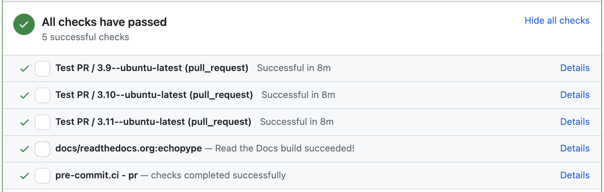

(contrib:setup)=
# Development setup

Thank you for your interests in contributing to Echopype! In this page you will find information on the development workflow, setting up a development environment, and details about testing and documentation.


## Trunk-based development
We have recently moved to follow [trunk-based development](https://www.atlassian.com/continuous-delivery/continuous-integration/trunk-based-development) to streamline the process and reduce repo management overhead.
The main thing to keep in mind is to set the PR target to the `main` branch in the `upstream` repository (the one sitting under the OSOceanAcoustics GitHub organization).
We will no longer use a `dev` branch.


## Development environment

To create an environment for developing Echopype, we recommend the following steps:

1. Fork the Echopype repository, clone your fork to your machine, then in `git remote` set your fork as the `origin` and the OSOceanAcoustics repository as `upstream`:
    ```shell
    # Clone your fork
    git clone https://github.com/YOUR_GITHUB_USERNAME/echopype.git

    # Go into the cloned repo folder
    cd echopype

    # Add the OSOceanAcoustics repository as upstream
    git remote add upstream https://github.com/OSOceanAcoustics/echopype.git
    ```

2. Create a development environment using [`uv`](https://github.com/astral-sh/uv):
    ```shell
    # Generate or update the lock file
    uv lock

    # Install runtime dependencies from ``uv.lock``
    uv sync

    # Install development tools defined in ``pyproject.toml``
    uv sync --extra dev

    # Install ``echopype`` in editable mode with optional extras
    uv pip install -e . --extra dev --extra docs --extra plot

    # Verify that packages were installed
    uv pip list | head

    # Set up pre-commit hooks
    uv run pre-commit install
    uv run pre-commit run --files echopype/__init__.py
    ```


## Testing infrastructure

### Test data files

Currently, test data are stored in a private Google Drive folder and
made available via the [`cormorack/http`](https://hub.docker.com/r/cormorack/http)
Docker image on Docker hub.
The image is rebuilt daily when new test data are added.
If your tests require adding new test data, ping the maintainers (@leewujung, @ctuguinay)
to get them added to the the Google Drive.

We hope to migrate all test data to GitHub Release Assets in the near future,
to keep test data versioned and directly associated with the repo.


### Running the tests

To run echopype tests found in `echopype/tests`,
[`Docker`](https://docs.docker.com/get-docker/) needs to be installed.
The [`docker compose` plugin](https://docs.docker.com/compose/) is also needed,
but it should already be installed in the development environment created above.

To run the tests:
```shell
# Install and/or deploy the echopype docker containers for testing.
# Test data files will be downloaded
uv run .ci_helpers/docker/setup-services.py --deploy

# Run all the tests
uv run .ci_helpers/run-test.py --local --pytest-args="-vv"

# When done, "tear down" the docker containers
uv run .ci_helpers/docker/setup-services.py --tear-down
```

The tests include reading and writing from locally set up (via docker)
http and [S3 object-storage](https://en.wikipedia.org/wiki/Amazon_S3) sources,
the latter via [minio](https://minio.io).

[`.ci_helpers/run-test.py`](https://github.com/OSOceanAcoustics/echopype/blob/main/.ci_helpers/run-test.py)
will execute all tests.
The entire test suite can take a few minutes to run.
You can use `run-test.py` to run only tests for specific subpackages
(`convert`, `calibrate`, etc) by passing a comma-separated list:
```shell
# Run only tests associated with the calibrate and mask subpackages
uv run .ci_helpers/run-test.py --local --pytest-args="-vv" echopype/calibrate/calibrate_ek.py,echopype/mask/api.py
```
or specific test files by passing a comma-separated list:
```shell
# Run only tests in the test_convert_azfp.py and test_noise.py files
uv run .ci_helpers/run-test.py --local --pytest-args="-vv"  echopype/tests/convert/test_convert_azfp.py,echopype/tests/clean/test_noise.py
```

For `run-test.py` usage information, use the ``-h`` argument:
```shell
`uv run .ci_helpers/run-test.py -h`
```

``scripts/run_pr_checks.sh`` combines these steps by running the pre-commit
hooks on the staged files, deploying the test services, running tests only for
files changed relative to ``origin/main`` with coverage enabled, and then
tearing the services down. Execute it from the repository root before opening a
pull request:

```shell
scripts/run_pr_checks.sh
```


## pre-commit hooks

This project uses [pre-commit](https://pre-commit.com) to check formatting and style.
The hooks are defined in
[.pre-commit-config.yaml](https://github.com/OSOceanAcoustics/echopype/blob/main/.pre-commit-config.yaml)
and are installed as part of the ``dev`` dependencies above.

To enable them locally run:

```shell
uv run pre-commit install
```

The hooks run automatically on ``git commit``. You can trigger them manually with:

```shell
uv run pre-commit run --all-files
```

See the [pre-commit usage documentation](https://pre-commit.com/#usage) for details.


<!--
OLD CONTENT WHEN WE USED A DEV BRANCH
CURRENT CI RUNS ENTIRE TEST SUITE FOR PR TO MAIN

echopype makes extensive use of GitHub Actions for continuous integration (CI)
of unit tests and other code quality controls. Every pull request (PR) triggers the CI.
See `echopype/.github/workflows <https://github.com/OSOceanAcoustics/echopype/tree/main/.github/workflows>`_,
especially `pr.yaml <https://github.com/OSOceanAcoustics/echopype/blob/main/.github/workflows/pr.yaml>`_.

The entire test suite can be a bit slow, taking up to 40 minutes or more.
To mitigate this, the CI default is to run tests only for subpackages that
were modified in the PR; this is done via ``.ci_helpers/run-test.py``
(see the `Running the tests`_ section). To have the CI execute the
entire test suite, add the string "[all tests ci]" to the PR title.
Under special circumstances, when the submitted changes have a
very limited scope (such as contributions to the documentation)
or you know exactly what you're doing
(you're a seasoned echopype contributor), the CI can be skipped.
This is done by adding the string "[skip ci]" to the PR title. -->


## Documentation

### Function and object docstrings

For inline strings documenting functions and objects ("docstrings"),
we use the [numpydoc style](https://numpydoc.readthedocs.io/en/latest/format.html) (Numpy docstring format).


### General setup

Echopype documentation (https://echopype.readthedocs.io) is based on [Jupyter Book](https://jupyterbook.org/en/stable/intro.html),
which are rendered under the hood with [Sphinx](https://www.sphinx-doc.org).
The documentation is hosted on [Read The Docs](https://readthedocs.org).

To build the documentation locally, run:
```shell
jupyter-book build docs/source --path-output docs
```

To view the HTML files generated by Jupyter Book, open `docs/_build/html/index.html` in your browser.

-For some quick orientation of where things are:
- The documentation package dependencies are declared under the `docs` extra in `pyproject.toml`
- The documentation source files are in the `docs/source` directory
- The Jupyter Book [configurations](https://jupyterbook.org/en/stable/customize/config.html)
  is in `docs/source/_config.yml`
- The [table of contents](https://jupyterbook.org/en/stable/structure/toc.html) for the sidebar
  is in `docs/source/_toc.yml`

### Versions

ReadTheDocs defaults to having its `stable` version tracking the most recent release and the `main` version tracking the latest changes in the `main` branch of the repository. We follow this pattern for our documentation. See [RTD Versions](https://docs.readthedocs.io/en/stable/versions.html) for more information.


(contrib:setup_CI)=
## GitHub Actions for continuous integration (CI)
When a PR is created, the CI will run through all tests, basic spelling and formatting checks (via pre-commit), and build the documentation.
You can check the test results in a section at the bottom of the PR like below:


To see the newly built documentation, click  "Details" to the right of the
`docs/readthedocs.org:echopype` entry shown above.
