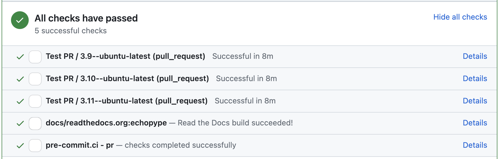

# Contributing to echopype


:::{note}
We welcome your contributions, large or small!
- Contributions to both code and documentation via Pull Requests are highly appreciated
- Bug reports, feature requests, and questions via Issues are also welcome
:::


## Contributing on GitHub

### Bug reports, feature requests, questions
Please ask questions, report bugs, or request new features via GitHub issues.
If you're new to GitHub, checking out these tips for [creating issues on GitHub](https://medium.com/nyc-planning-digital/writing-a-proper-github-issue-97427d62a20f).

### Contributions to code and documentation
We use the fork-branch-pull request (PR) workflow to add new code into Echopype.
If you are new to this workflow, check out this [tutorial](https://medium.com/swlh/forks-and-pull-requests-how-to-contribute-to-github-repos-8843fac34ce8).

We have recently moved away from Gitflow development to [trunk-based development](https://www.atlassian.com/continuous-delivery/continuous-integration/trunk-based-development) to streamline the process and reduce repo management overhead.
The main thing to keep in mind is to set the PR target to the `main` branch in the `upstream` repository (the one sitting under the OSOceanAcoustics GitHub organization).
We will no longer use a `dev` branch.

We encourage all code contributions to be accompanied by tests and documentations when appropriate.
We may ask for these when reviewing the PRs.
If you have added new tests but the [GitHub Actions for continuous integration](#github-actions-for-continuous-integration-ci) need approval to run, ping the maintainers (@leewujung, @ctuguinay) to get them started.


## Development environment

To create an environment for developing Echopype, we recommend the following steps:

1. Fork the Echopype repository following the guide above, clone your fork, then in `git remote` set your fork as the `origin` and the OSOceanAcoustics repository as `upstream`:
    ```shell
    # Clone your fork
    git clone https://github.com/YOUR_GITHUB_USERNAME/echopype.git

    # Go into the cloned repo folder
    cd echopype

    # Add the OSOceanAcoustics repository as upstream
    git remote add upstream https://github.com/OSOceanAcoustics/echopype.git
    ```

2. Create a conda environment using the conda-forge channel, and follow the steps below:
    ```shell
    # Create a conda environment using the supplied requirements files
    # Note the last one docs/requirements.txt is only required for building docs
    conda create -c conda-forge -n echopype --yes python=3.9 --file requirements.txt --file requirements-dev.txt --file docs/requirements.txt

    # Switch to the newly built environment
    conda activate echopype

    # ipykernel is recommended, in order to use with JupyterLab and IPython for development
    # We recommend you install JupyterLab separately
    conda install -c conda-forge ipykernel

    # install echopype in editable mode (setuptools "develop mode")
    # plot is an extra set of requirements that can be used for plotting.
    # the command will install all the dependencies along with plotting dependencies.
    pip install -e ".[plot]"
    ```

:::{note}
It's common to encounter the situation that installing packages using Conda is slow or fails,
because Conda is unable to resolve dependencies.
We suggest using Mamba to get around this.
See [Mamba's documentation](https://mamba.readthedocs.io/en/latest/) for installation and usage.
One can replace `conda` with `mamba` in the above commands when creating the environment and installing additional packages.
:::


## Testing infrastructure

### Test data files

Currently, test data are stored in a private Google Drive folder and
made available via the [`cormorack/http`](https://hub.docker.com/r/cormorack/http)
Docker image on Docker hub.
The image is rebuilt daily when new test data are added.
If your tests require adding new test data, ping the maintainers (@leewujung, @ctuguinay)
to get them added to the the Google Drive.

In the near future we plan to migrate all test data to GitHub Release Assets,
to keep test data versioned and directly associated with the repo.


### Running the tests

To run the echopype unit tests found in `echopype/tests`,
[`Docker`](https://docs.docker.com/get-docker/) needs to be installed.
[`docker-compose`](https://docs.docker.com/compose/) is also needed,
but it should already be installed in the development environment created above.

To run the tests:
```shell
# Install and/or deploy the echopype docker containers for testing.
# Test data files will be downloaded
python .ci_helpers/docker/setup-services.py --deploy

# Run all the tests. But first make sure the
# echopype development conda environment is activated
python .ci_helpers/run-test.py --local --pytest-args="-vv"

# When done, "tear down" the docker containers
python .ci_helpers/docker/setup-services.py --tear-down
```

The tests include reading and writing from locally set up (via docker)
http and [S3 object-storage](https://en.wikipedia.org/wiki/Amazon_S3) sources,
the latter via [minio](https://minio.io).

[`.ci_helpers/run-test.py`](https://github.com/OSOceanAcoustics/echopype/blob/main/.ci_helpers/run-test.py)
will execute all tests.
The entire test suite can take a few minutes to run.
You can use `run-test.py` to run only tests for specific subpackages
(`convert`, `calibrate`, etc) by passing a comma-separated list:
```shell
# Run only tests associated with the calibrate and mask subpackages
python .ci_helpers/run-test.py --local --pytest-args="-vv" echopype/calibrate/calibrate_ek.py,echopype/mask/api.py
```
or specific test files by passing a comma-separated list:
```shell
# Run only tests in the test_convert_azfp.py and test_noise.py files
python .ci_helpers/run-test.py --local --pytest-args="-vv"  echopype/tests/convert/test_convert_azfp.py,echopype/tests/clean/test_noise.py
```

For `run-test.py` usage information, use the ``-h`` argument:
```shell
`python .ci_helpers/run-test.py -h`
```


## pre-commit hooks

The echopype development conda environment includes [pre-commit](https://pre-commit.com),
and useful pre-commit "hooks" have been configured in the
[.pre-commit-config.yaml file](https://github.com/OSOceanAcoustics/echopype/blob/main/.pre-commit-config.yaml).
Current hooks include file formatting (linting) checks
(trailing spaces, trailing lines, JSON and YAML format checks, etc)
and Python style autoformatters (PEP8 / flake8, `black` and `isort`).

To run pre-commit hooks locally, run `pre-commit install` before running the
docker setup-service deploy statement described above.
The hooks will run automatically during `git commit` and will give you
options as needed before committing your changes.
You can also run `pre-commit` before actually doing `git commit` as you edit the code,
by running `pre-commit run --all-files`.
See the [pre-commit usage documentation](https://pre-commit.com/#usage) for details.


<!--
OLD CONTENT WHEN WE USED A DEV BRANCH
CURRENT CI RUNS ENTIRE TEST SUITE FOR PR TO MAIN

echopype makes extensive use of GitHub Actions for continuous integration (CI)
of unit tests and other code quality controls. Every pull request (PR) triggers the CI.
See `echopype/.github/workflows <https://github.com/OSOceanAcoustics/echopype/tree/main/.github/workflows>`_,
especially `pr.yaml <https://github.com/OSOceanAcoustics/echopype/blob/main/.github/workflows/pr.yaml>`_.

The entire test suite can be a bit slow, taking up to 40 minutes or more.
To mitigate this, the CI default is to run tests only for subpackages that
were modified in the PR; this is done via ``.ci_helpers/run-test.py``
(see the `Running the tests`_ section). To have the CI execute the
entire test suite, add the string "[all tests ci]" to the PR title.
Under special circumstances, when the submitted changes have a
very limited scope (such as contributions to the documentation)
or you know exactly what you're doing
(you're a seasoned echopype contributor), the CI can be skipped.
This is done by adding the string "[skip ci]" to the PR title. -->


## Documentation

### Function and object docstrings

For inline strings documenting functions and objects ("docstrings"),
we use the [numpydoc style](https://numpydoc.readthedocs.io/en/latest/format.html) (Numpy docstring format).


### General setup

Echopype documentation (https://echopype.readthedocs.io) is based on [Jupyter Book](https://jupyterbook.org/en/stable/intro.html),
which are rendered under the hood with [Sphinx](https://www.sphinx-doc.org).
The documentation is hosted on [Read The Docs](https://readthedocs.org).

To build the documentation locally, run:
```shell
jupyter-book build docs/source --path-output docs
```

To view the HTML files generated by Jupyter Book, open `docs/_build/html/index.html` in your browser.

For some quick orientation of where things are:
- The documentation package dependencies are in `docs/requirements.txt`
- The documentation source files are in the `docs/source` directory
- The Jupyter Book [configurations](https://jupyterbook.org/en/stable/customize/config.html)
  is in `docs/source/_config.yml`
- The [table of contents](https://jupyterbook.org/en/stable/structure/toc.html) for the sidebar
  is in `docs/source/_toc.yml`

### Versions

ReadTheDocs defaults to having its `stable` version tracking the most recent release and the `main` version tracking the latest changes in the `main` branch of the repository. We follow this pattern for our documentation. See [RTD Versions](https://docs.readthedocs.io/en/stable/versions.html) for more information.


## GitHub Actions for continuous integration (CI)
When a PR is created, the CI will run through all tests, basic spelling and formatting checks
(via pre-commit), and build the documentation.
You can check the test results in a section at the bottom of the PR like below:


To see the newly built documentation, click  "Details" to the right of the
`docs/readthedocs.org:echopype` entry shown above.
