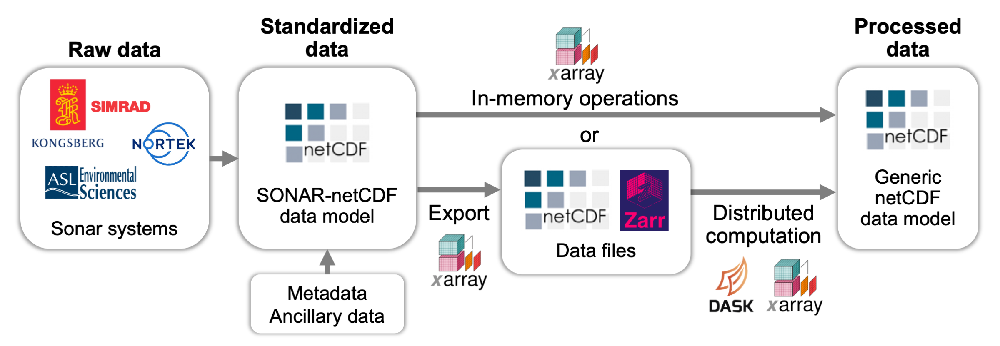

# Data processing

We aim for Echopype to provide "building blocks" that can be strung together to construct processing pipelines for water column sonar data to bring raw instrument-generated files to analysis-ready data products that can be easily leveraged by further downstream processing routines.

To this end, the Echopype workflow focuses first on standardizing instrument-generated data to a netCDF data model (the `EchoData` object), and build computational routines based on the standardized data. Specifically, beyond the `EchoData` objects, the calibrated `Sv` and outputs of all subsequent data processing functions are generic [xarray Datasets](https://docs.xarray.dev/en/stable/user-guide/data-structures.html#dataset). This allows new processing functions be easily added without needing to understand specialized objects, other than functions needing access of data stored only in the raw-converted `EchoData` objects.

See the [Echopype paper](https://doi.org/10.1093/icesjms/fsae133) for more details on the design philosophy.

In this section:
-  discusses current processing functions and their usage
-  discusses some aspects of processed data that may require additional explanation
